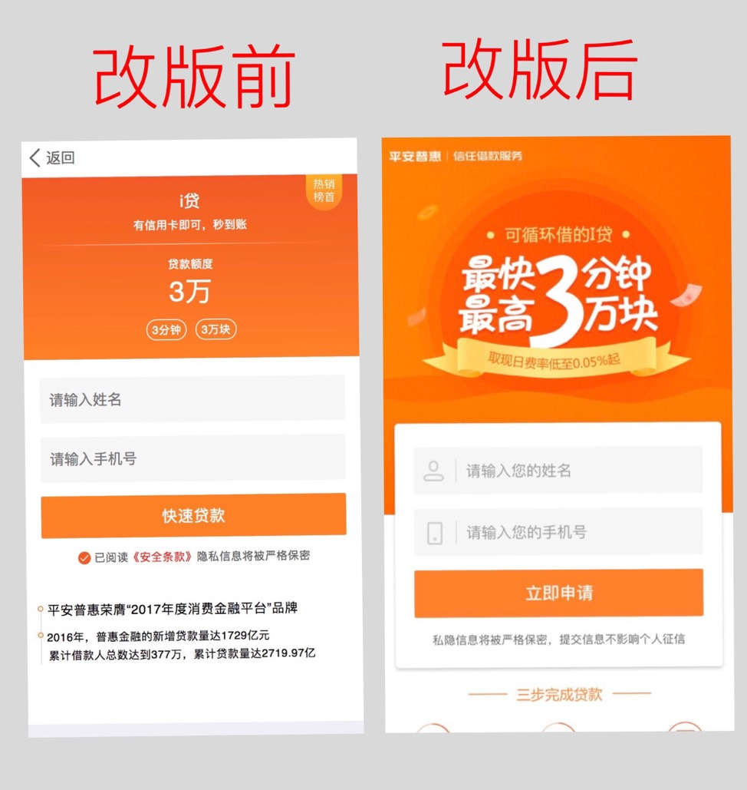

# H5玩转下拉上滑

## 背景

在我们的日常项目中，经常会遇到这样的需求，为了提高用户体验而做的优化改版，如最近的M站的贷款详情页改版。

如下图所示：

<!--  -->


## 思考

这次的优化，按照产品经理的说法就是后者的转化率更好，那为什么呢？

其实在排除产品因素前提下，改版后的页面给我们最直观的感受就是UI更加地美观了！

再进一步思考，除了实现UI之外，能否再让用户体验更上一个层次？

提高交互体验，在下拉上滑上做些动作！

## 最终实现效果

这里请扫码食用...


## 技术实现

具体**过程分解**：

监听列表滑动事件 -> 根据Y轴偏移量计算比例 -> 根据偏移量改变列表的位置，同时根据比例改变banner的缩放和滤镜效果

技术栈：Vue + better-scroll

关键代码节选片段：

```js
  // scroll组件
  let _this = this
  this.scroll.on('scroll', (pos) => {
    _this.$emit('scroll', pos)
  })

  // 父组件实时监测scollY的值并作处理
  watch: {
    scrollY (newVal) {
      let scale = 1
      let blur = 0
      const percent = Math.abs(newVal / this.imageHeight)

      if (newVal > 0) {
        scale = 1 + percent
      } else {
        blur = Math.min(20, percent * 20)
      }

      // 上滑滤镜效果
      this.$refs.filter.style[backdrop] = `blur(${blur}px)`
      // 下拉放大效果
      this.$refs.bgImage.style[transform] = `scale(${scale})`
    }
  }
```

## 总结

在体验至上的现今，我们的产品对体验更是精益求精。面临不同的产品需求，我们需要正确选择恰当的技术解决方案，不管是原生开发、H5开发、还是Hybrid App混合开发，其最终的目的是完美的解决产品需求，没有最好的技术，只有最佳的技术解决方案。


