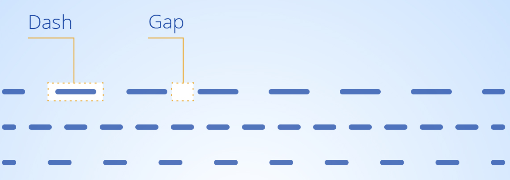

# 玩转SVG动画


> **可缩放矢量图形（Scalable Vector Graphics，SVG）**，是一种用于描述基于二维的矢量图形的，基于 XML 的标记语言。本质上，SVG 相对于图像，就好比 HTML 相对于文本。

## 动画元素

动画元素放在形状元素的内部，用来定义一个元素的某个属性如何踩着时点改变。在指定持续时间里，属性从开始值变成结束值。

SVG动画元素有以下几个：`<animate>`，`<animateColor>`，`<animateTransform>`，`<animateMotion>`，`<discard>`，`<mpath>`，`<set>`

### animate

`animate`是基础动画元素，实现单属性的动画过渡效果。


```html
<svg width="200" height="200" xmlns="http://www.w3.org/2000/svg">
  <g> 
    <text font-size="100" y="130" x="100">
    🐖
      <animate attributeName="x" from="150" to="50" begin="0s" dur="3s" repeatCount="indefinite" />
    </text>
  </g>
</svg>
```

也可以同时使用多个`animate`


```html
<svg width="200" height="200" xmlns="http://www.w3.org/2000/svg">
  <g> 
    <text font-size="100" y="130" x="100">
    🐖
      <animate attributeName="x" from="150" to="50" begin="0s" dur="3s" repeatCount="indefinite" />
      <animate attributeName="opacity" from="0" to="1" begin="0s" dur="3s" repeatCount="indefinite" />
    </text>
  </g>
</svg>
```

### animateTransform

一看这属性就知道实现`transform`变换动画效果的~


```html
<svg width="200" height="200" xmlns="http://www.w3.org/2000/svg">
  <g> 
    <text font-size="50" y="80" x="80">🐷</text>
    <animateTransform attributeName="transform" begin="0s" dur="3s"  type="scale" from="1" to="1.5" repeatCount="indefinite"/>
  </g>
</svg>
```

### animateMotion

`animateMotion`元素可以让SVG各种图形沿着特定的`path`路径运动~

那就来感受一下会爬山的猪~


```html
<svg width="360" height="200" xmlns="http://www.w3.org/2000/svg">
  <text font-size="40" x="0" y="0" fill="#cd0000">猪
    <animateMotion path="M10,80 q100,120 120,20 q140,-50 160,0" rotate="auto" begin="0s" dur="3s" repeatCount="indefinite"/>
  </text>
  <path d="M10,80 q100,120 120,20 q140,-50 160,0" stroke="#cd0000" stroke-width="2" fill="none" />
</svg>
```

### 动画的暂停与播放

SVG其实内置了动画的暂停和播放的API：
```js
// 暂停
svg.pauseAnimations();

// 播放
svg.unpauseAnimations();
```

<sharing-SVG/>

### 最强大的元素 ---- `path`

> `path`是一个可以构建出你所能想象的几乎任何高级的2D图形的基本形状~

那么如何做`path`动画呢？

这里我们用到SVG的两个属性：`stroke-dasharray` 和 `stroke-dashoffset`。

`stroke-dasharray` 属性可以控制图案描边路径的样式，如果你并不想用连续的直线去绘制路径，而希望通过一些不同样式的虚线，你就可以使用这个属性。



`stroke-dashoffset` 属性设置虚线在原路径下的偏移量。

### path动画原理 

为了平稳流畅地绘制出这个路径，首先我们需要通过 `stroke-dasharray` 属性设置虚线段的长度，将 `stroke-dasharray` 属性的值设为该路径的长度。这样的话就将虚线的每一段 `dash` 和 `gap` 的长度等于整段路径的长。

下一步我们需要使用 `stroke-dashoffset` 属性将虚线的偏移量设置为 0，此时我们看到的路径描边就是没有间断的连续曲线（实际上看到的是虚线段的第一段，前面已经设置每一虚线段的长度等于该曲线的长）。通过设置虚线偏移量等于曲线的长度，那该曲线恰好“消失”（实际上看到的是虚线段的一段间隙）。

通过 `stroke-dashoffset` 属性，同时结合 CSS3 的 `animation`，你可以让该曲线一点点的出现在屏幕上，这就是 SVG 路径动画的原理。

<sharing-Path/>

```html
<svg width="300" height="175" xmlns="http://www.w3.org/2000/svg">
  <path class="path" fill="transparent" stroke="#000000" stroke-width="4" d="M10 80 Q 77.5 10, 145 80 T 280 80"></path>
</svg>
```

```scss
svg {
  display: block;
  width: 300px;
  .path {
    stroke-dasharray: 320;
    stroke-dashoffset: 0;
    animation: dash 1s linear;
  }
  @keyframes dash {
    from {
      stroke-dashoffset: 320;
    }
    to {
      stroke-dashoffset: 0;
    }
  }
}
```

### 如何配合Javascript擦出更大的火花

#### Step 1: 先来个`path`
```html
<svg xmlns="http://www.w3.org/2000/svg" viewBox="0 0 100.6 107.6" id="star-svg">
  <path id="star-path" fill="none" stroke="black" stroke-width="2"  d="..." />
</svg>
```

#### Step 2: 获取`path`的长度
```js
var path = document.querySelector('.path');
var pathLength = path.getTotalLength();
```

#### Step 3: 结合 `stroke-asharray` 和 `stroke-dashoffset` 把形状隐藏起来
```js
path.style.strokeDasharray = pathLength + ' ' + pathLength;
path.style.strokeDashoffset = pathLength;
```

#### Step 4: 当页面滚动, 把偏移量百分比设置为滚动的百分比
```js
// 当页面滚动起来~
window.addEventListener("scroll", function(e) {
 
  // 滑动的百分比是多少？ 
  var scrollPercentage = (document.documentElement.scrollTop + document.body.scrollTop) / (document.documentElement.scrollHeight - document.documentElement.clientHeight);
    
  // 虚线偏移量
  var drawLength = pathLength * scrollPercentage;
  
  // 设置偏移量
  path.style.strokeDashoffset = pathLength - drawLength;
  
});
```
<sharing-Scroll/>

这次的分享就到此结束啦，希望对大家有所帮助~ 谢谢！